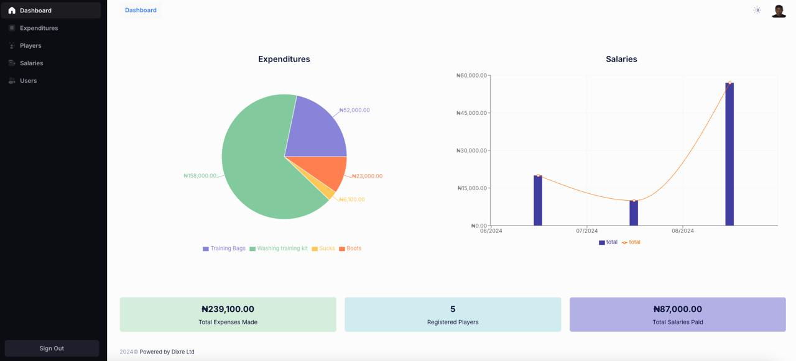

# ECJ Football Academy Management Dashboard

## Overview

This project is a comprehensive dashboard application designed for a football academy. The dashboard provides tools for managing players, tracking expenditures, viewing reports, managing salaries, and more. Built with modern web technologies, the application aims to streamline operations within the academy and provide a user-friendly interface for administrators.

## Features

- **Player Management**: Add, edit, and remove players from the academy's roster. Keep track of player details and performance statistics.
- **Expenditure Tracking**: Monitor and manage the academy's expenditures. Categorize spending and keep a detailed record of financial transactions.
- **Salary Management**: Handle player and staff salaries with ease. Automate salary calculations and keep track of payments.
- **Reports**: Generate and view detailed reports on various aspects of the academy's operations, including financial summaries, player performance, and more.

## Technologies Used

- **React**: The application is built using React, a popular JavaScript library for building user interfaces.
- **TypeScript**: TypeScript is used to ensure proper type checking.
- **Vite**: The project was set up with Vite, a fast development build tool that offers a highly efficient development experience.
- **Redux**: Redux is used for state management, ensuring that the application's state is managed in a predictable and centralized manner.
- **Redux Saga**: Redux Saga is employed for handling asynchronous requests, providing an elegant way to manage side effects in the application.
- **Metronic Template**: The user interface is based on the popular Metronic template, providing a professional and polished design that is both responsive and customizable.
